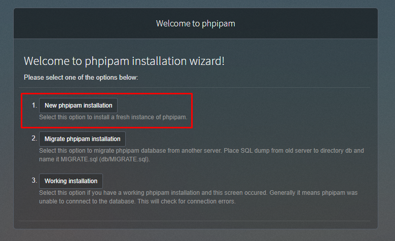
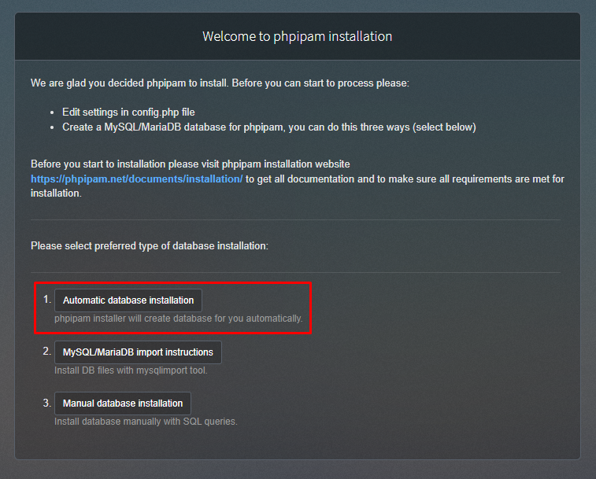
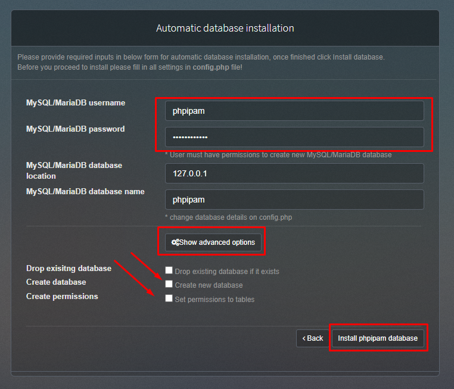
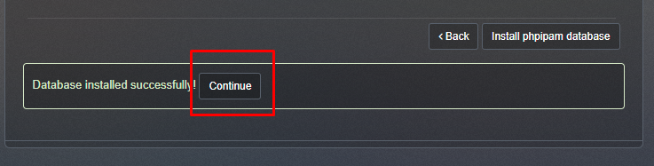
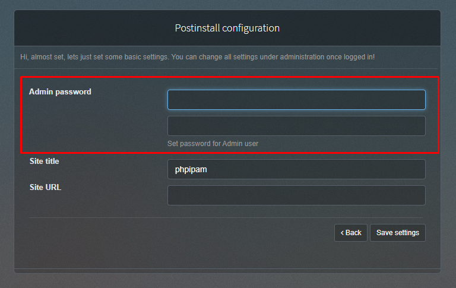
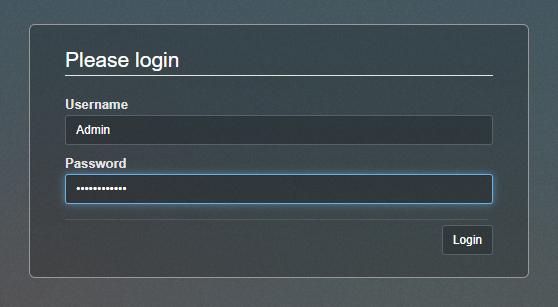

# :rocket: PHPIPAM

### Instalação do Gestor de IPS PHPIPAM

---

* Preparação do Ambiente - Ubuntu 18.04:
```
apt -y update && apt -y upgrade
```
---

* Instalação do Servidor Web - Apache2:
```
apt -y install apache2 apache2-utils
a2enmod rewrite
a2enmod headers
systemctl restart apache2
```
---

* Instalação do Bando de Dados - MariaDB:
```
apt -y install mariadb-server mariadb-client
```
---

* Instalação do PHP - Versão 7:
```
apt -y install libapache2-mod-php php php-mysql php-cli php-pear php-gmp php-gd php-bcmath php-mbstring php-curl php-xml php-zip
systemctl restart apache2
```
---

* Criar a Base de Dados:
```
mariadb -p
CREATE DATABASE phpipam;
GRANT ALL PRIVILEGES ON phpipam.* TO 'phpipam'@'localhost' IDENTIFIED BY 'phpipamadmin';
FLUSH PRIVILEGES;
quit;
```
---

* Instalando PHPIPAM - Versão 1.5.0: https://github.com/phpipam/phpipam/releases
```
cd /tmp
wget https://github.com/phpipam/phpipam/releases/download/v1.5.0/phpipam-v1.5.0.tgz
tar vxf phpipam-v1.5.0.tgz
mv phpipam/* /var/www/html/
rm /var/www/html/index.html
```
---

* Ajuste de Permissões:
```
find /var/www/* -type d -exec chmod 755 {} \;
find /var/www/* -type f -exec chmod 644 {} \;
```

--- 

* Arquivo de Configurações
```
cd /var/www/html/
cp config.dist.php config.php
nano config.php

$db['host'] = '127.0.0.1';
$db['user'] = 'phpipam';
$db['pass'] = 'phpipamadmin';
$db['name'] = 'phpipam';
$db['port'] = 3306;
```
---

### Acesse seu servidor através do IP no navegador Web para finalizar as configurações

#### Nova instalação do PHPIPAM


---

#### Instalação automática


---

#### Informe os dados de conexão ao banco de dados, em opções avançadas, deixe todos desmarcados.


---

#### Clique em Continue


---

#### Informe a senha de Admin


---

#### Acesse o painel, Usuário Padrão: Admin


---

## :sparkling_heart: Nos Ajude a Crescer
>Se este Material foi útil para você, ajude se inscrevendo no meu canal do YouTube.
>
>(https://youtube.com/techlabs94?sub_confirmation=1)
> 
>Isso me incentiva a trazer mais materiais como este e muitos outros de redes e tecnologia.
> 
>## 

## :iphone: Contato e Informações
[](https://api.whatsapp.com/send?phone=5537999351046)